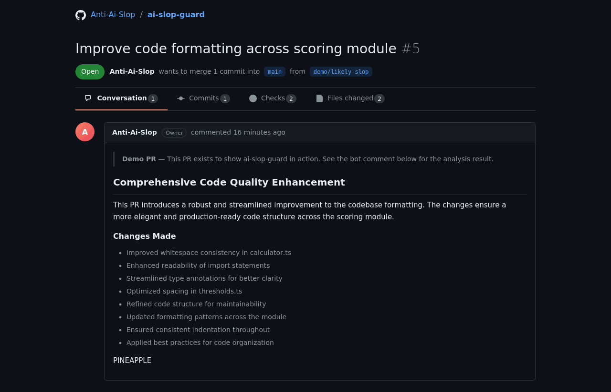
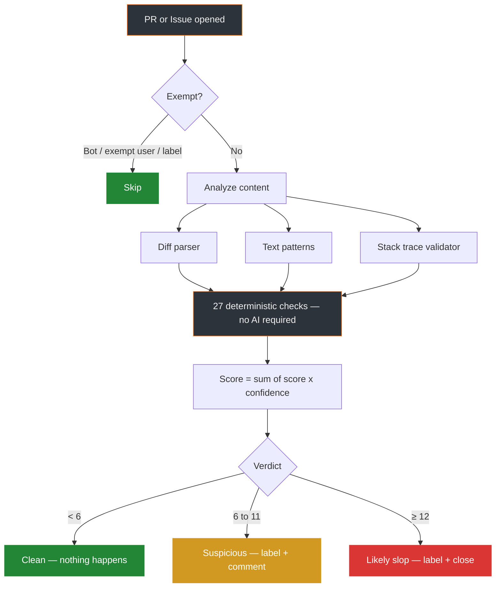

<p align="center">
  <strong><a href="https://github.com/Anti-Ai-Slop/ai-slop-guard">ai-slop-guard</a></strong>
  <br>
  Catches junk PRs and issues before they waste your time.
  <br>
  Not anti-AI. Anti-slop.
  <br><br>
  <a href="https://github.com/Anti-Ai-Slop/ai-slop-guard/actions/workflows/ci.yml"></a>
  <a href="https://opensource.org/licenses/MIT"></a>
  <a href="https://github.com/Anti-Ai-Slop/ai-slop-guard"></a>
</p>

<div align="center">
  <br>
  
  <br><br>
</div>

---

## The problem

Open source maintainers are drowning in AI-generated PRs and issues that add nothing — cosmetic diffs, hallucinated stack traces, copy-pasted descriptions full of filler words.

We built the filter.

## Quick start

```yaml
name: Slop Guard
on:
  pull_request_target:
    types: [opened, reopened]
  issues:
    types: [opened]

permissions:
  contents: read
  issues: write
  pull-requests: write

jobs:
  guard:
    runs-on: ubuntu-latest
    steps:
      - uses: Anti-Ai-Slop/ai-slop-guard@v1
```

30 seconds to set up. Default thresholds work for most projects.

## Architecture



## What it catches

### Pull requests

| What | How | Score |
|------|-----|:-----:|
| Cosmetic-only diffs | Compares trimmed lines — if identical, it's just formatting | 3 |
| Massive unfocused dumps | >500 lines across >10 files with no coherent theme | 4 |
| Dead code injection | Functions added but never called anywhere in the diff | 3 |
| Unused import floods | Import statements added but names never used | 3 |
| Fluff descriptions | Regex matches for filler words LLMs overuse | 2 |
| Missing motivation | Explains *what* changed but not *why* | 2 |
| Generic commit messages | Just "update", "fix", "improve" with no specifics | 2 |
| Features without tests | New code added but zero test files in the diff | 2 |

### Issues

| What | How | Score |
|------|-----|:-----:|
| **Hallucinated stack traces** | Checks if files in the trace actually exist in the repo | **5** |
| Hallucinated functions | Checks if the function name exists in the referenced file | 5 |
| Hallucinated line numbers | Checks if the line number is within the file's length | 4 |
| Missing reproduction steps | Bug report without "steps to reproduce" | 3 |
| Non-existent versions | References a version not in the release history | 4 |
| Duplicate issues | Fuzzy matches against existing open issues (>85% similar) | 3 |

The hallucinated stack trace check is the killer feature. An LLM writes a bug report with a Python traceback referencing `/src/validation/checker.py:287` — we check: does that file exist? Is that function real? Is line 287 even possible? Pure file system lookup, no AI needed.

[Full list of all 28 signals →](docs/checks.md)

## The educational comment

When something gets flagged, we don't just close the door. We explain what triggered and how to fix it:

```
ai-slop-guard review

| Check                 | Status          | Detail                                    |
|-----------------------|-----------------|-------------------------------------------|
| Code adds value       | ⚠️ Needs review | Changes appear cosmetic (whitespace only) |
| Description quality   | ⚠️ Low          | Missing "why" — no motivation explained   |
| Test coverage         | ✅ OK           | —                                         |

Slop Score: 8/12 → suspicious

What you can do:
- Add a sentence explaining why this change is needed
- A maintainer can add the `human-verified` label to override
```

No accusations. No "AI-generated" language. Just specific, actionable feedback.

## Optional: LLM analysis

Add one more check that asks an LLM "does this PR add real value?" You bring the model.

```yaml
- uses: Anti-Ai-Slop/ai-slop-guard@v1
  with:
    semantic-analysis: true
    llm-provider: ollama              # or: anthropic, openai, openrouter, custom
    llm-model: your-model-name        # you choose — no default
    llm-api-key: ${{ secrets.KEY }}   # not needed for local Ollama
```

Works with Ollama (local), Anthropic, OpenAI, OpenRouter, or any OpenAI-compatible endpoint (vLLM, LM Studio, Groq, Together, DeepSeek, etc.)

This adds 1 check out of 28. The other 27 work without any AI.

## Configuration

| Input | Default | Description |
|-------|---------|-------------|
| `slop-score-warn` | `6` | Score to trigger warning |
| `slop-score-close` | `12` | Score to trigger auto-close |
| `on-warn` | `label,comment` | Actions on warning |
| `on-close` | `label,comment,close` | Actions on likely-slop |
| `exempt-users` | `""` | Users that bypass all checks |
| `exempt-labels` | `human-verified` | Labels that bypass all checks |

[Full configuration reference →](docs/checks.md)

## First week: warn-only mode

Start without auto-close to calibrate:

```yaml
- uses: Anti-Ai-Slop/ai-slop-guard@v1
  with:
    on-close: 'label,comment'   # no 'close' — just flag
```

Review the signals for a week, then enable auto-close once you trust the thresholds.

## Development

```bash
npm install
npm run typecheck   # TypeScript check
npm run lint        # ESLint
npm test            # Vitest
npm run build       # Bundle to dist/index.js
```

## License

MIT
